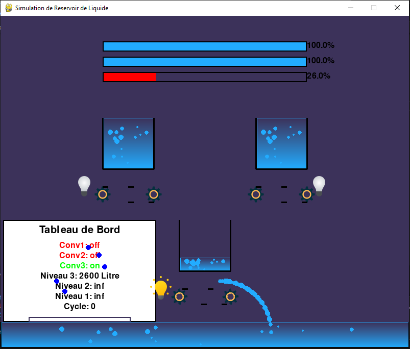

# TP : Réseaux industriels et supervision


## Interface Pygame


### Date
29 Mai 2024

Vous pouvez trouver le code source complet du projet sur GitHub à l'adresse suivante : [https://github.com/Fonocol/pygame/](https://github.com/Fonocol/pygame/)

Vous pouvez également visionner une vidéo de démonstration de la simulation de réservoir de liquide en suivant ce lien : [Vidéo de démonstration](https://github.com/Fonocol/pygame/raw/main/Assetes/video.mp4)

---

## Table des matières

1. [Introduction](#introduction)
2. [Interface Pygame](#interface-pygame)
    1. [Interface principale](#interface-principale)
    2. [Cycle de remplissage](#cycle-de-remplissage)
    3. [Cycle de vidange](#cycle-de-vidange)
3. [Annexe](#annexe)
    1. [La liste des icônes créées](#la-liste-des-icônes-créées)
    2. [Un diagramme des classes](#un-diagramme-des-classes)
    3. [Codes sources](#codes-sources)

## Introduction

> Dans ce TP, nous avons développé une interface de simulation de réservoir de liquide en utilisant Pygame. Cette interface simule un système de contrôle industriel et permet de visualiser le niveau de liquide dans le réservoir, ainsi que de contrôler différents composants du système.

## Interface Pygame

### Interface principale


*Figure 1 : Interface principale de la simulation de réservoir de liquide.*

Dans cette interface, l'utilisateur peut lancer une simulation en cliquant sur le bouton START ou quitter la simulation en cliquant sur QUIT.

### Cycle de remplissage


*Figure 2 : Vue pendant le cycle de remplissage du réservoir de liquide.*

Cette image montre le réservoir de liquide pendant le cycle de remplissage, où le niveau de liquide augmente progressivement jusqu'à atteindre la capacité maximale du réservoir.

### Cycle de vidange


*Figure 3 : Vue pendant le cycle de vidange du réservoir de liquide.*

Dans cette image, on peut observer le réservoir de liquide pendant le cycle de vidange, où le niveau de liquide diminue progressivement jusqu'à ce que le réservoir soit complètement vidé.

## Annexe

### La liste des icônes créées

Dans notre interface, nous avons utilisé plusieurs icônes pour représenter différents états des composants. Voici les icônes utilisées :

**Icône représentant une Ampoule activée:**


**Icône représentant une Ampoule désactivée:**


**Icône représentant une roue:**


### Un diagramme des classes

Il est à noter que nous n'avons pas utilisé de programmation orientée objet (POO) dans ce projet, car la structure du code ne le nécessitait pas. Nous avons plutôt utilisé une approche procédurale pour développer l'interface de simulation.

### Codes sources

Vous pouvez trouver le code source complet du projet sur GitHub à l'adresse suivante : [https://github.com/Fonocol/pygame/](https://github.com/Fonocol/pygame/)

Vous pouvez également visionner une vidéo de démonstration de la simulation de réservoir de liquide en suivant ce lien : [Vidéo de démonstration](https://github.com/Fonocol/pygame/raw/main/Assetes/video.mp4)

#### Code Python

```python
# Code source de la simulation de réservoir de liquide.
# Vous pouvez trouver le code complet sur le dépôt GitHub
# Lien: https://github.com/Fonocol/pygame/
# Pour des raisons de lisibilité, seuls les 20 premières lignes sont montrées ici

import pygame
import os

# Initialisation de Pygame
pygame.init()

# Configuration de la fenêtre
size = (800, 600)
screen = pygame.display.set_mode(size)
pygame.display.set_caption("Simulation de Réservoir de Liquide")

# Chargement des images
background = pygame.image.load("background.png")
icon_on = pygame.image.load("./Assetes/Aon.png")
icon_off = pygame.image.load("./Assetes/Aoff.png")
wheel = pygame.image.load("./Assetes/roue.png")

# Boucle principale
running = True
while running:
    for event in pygame.event.get():
        if event.type == pygame.QUIT:
            running = False

    screen.blit(background, (0, 0))
    pygame.display.flip()

pygame.quit()
